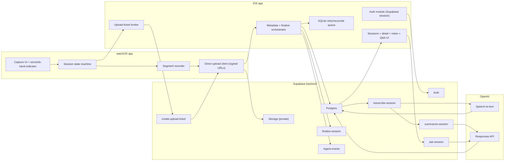

# Conversation Capture Implementation Plan (Combined)

Generated from split docs on 2026-02-25 18:57:28 CST.

Source folder: `docs/implementation-plan`

## Included Documents

1. 01 Product and Architecture
2. 02 Data Model and Storage
3. 03 Edge Functions and Pipeline
4. 04 Client Apps and Auth
5. 05 AI and Compliance
6. 06 API Contracts
7. 07 Observability and Rate Limits
8. 08 Delivery, Testing, and FAQ
9. 09 Sources
10. 10 Open Questions and Decision Log

---

# 01) Product and Architecture

Split from: `IMPLEMENTATION_BLUEPRINT.md`  
Last updated: `2026-02-26`

## 1) End goal (defined before coding)

### 1.1 Product vision

Build a fast, privacy-conscious conversation capture system where:

- Apple Watch is the lowest-friction capture surface.
- iPhone is the auth anchor and control surface.
- Supabase is the single backend platform for auth, database, storage, and server runtime.
- OpenAI is used for transcription, summarization, and session Q&A.

### 1.2 Locked v1 decisions (applied from answered questions)

- Language scope: English only.
- Recording consent UX: no extra onboarding consent UI; active recording indicator is the compliance surface.
- Recording indicator: seconds hand presence indicates active recording.
- Watch behavior: capture-only UI (no local history screen).
- Upload path: watch uploads audio directly to Supabase Storage using short-lived upload tickets issued under iPhone-authenticated user context.
- Summary flow: run automatically after transcription.
- Summary failure semantics: set session to `failed`.
- Q&A context: transcript + latest summary + user notes.
- Retention: raw audio short retention (`30 days` default), transcript/summary/Q&A/notes retained indefinitely by default.
- Deletion model: hard delete only in v1 (no soft-delete columns, no partial artifact deletion modes).
- Export model: no backend export job in v1; support copy/share from iPhone UI.
- Multi-device: support multiple iPhones per user.
- Rate and quota baseline: per-user daily transcription quota of `3600` audio seconds (easy to change in DB), plus monitor-mode rate limits in all environments initially.

### 1.3 V1 scope (must be complete)

1. Capture:
- User starts/stops multiple audio segments from watch in one conversation session.
- User finalizes session from watch.

2. Sync and processing:
- Watch uploads segments directly to Supabase Storage with signed upload tickets.
- iPhone upserts metadata and orchestrates finalize/retries.
- Backend transcribes and summarizes each finalized session automatically.

3. Retrieval:
- iPhone shows session list and details (transcript, summary, notes, Q&A).
- User can ask follow-up questions scoped to one session.
- User can copy/share transcript/summary/answer content from iPhone.

4. Observability:
- Every significant transition is tracked.
- Every pipeline stage is auditable, retryable, and correlated.

### 1.4 Non-goals (v1)

- No fully hidden recording mode.
- No non-English transcription/summarization.
- No watch local history UI.
- No multi-tenant team/shared workspace model.
- No custom model training.

### 1.5 Definition of done (release gate)

V1 is done only when all are true:

- Functional:
  - End-to-end path works from watch recording to iPhone Q&A.
  - Retries are safe (no duplicate side effects).
- Security and privacy:
  - RLS enforced on all user-owned tables.
  - Storage bucket(s) private by default.
  - Active recording indicator is always visible when capture is active.
- Reliability:
  - Upload/transcription/summarization failures are recoverable.
  - Summary failure transitions session to `failed`.
- Governance:
  - Per-user daily audio quota (`3600s`) is enforced with configurable DB settings.
  - Rate-limit evaluation runs in monitor mode in all environments at launch.
- Observability:
  - Mandatory event catalog implemented and validated.
  - Pipeline metrics, error codes, and cost metrics queryable in dashboards.

## 2) Research-backed implementation constraints

Validated against primary docs as of `2026-02-26`.

1. App Store policy constraint:
- App Review Guideline `2.5.14` requires explicit consent and clear visual and/or audible indication for recording user activity.
- Product implication: recording state cannot be hidden; seconds-hand indicator remains mandatory.

2. Watch connectivity behavior:
- `transferUserInfo` and `transferFile` are queued background-capable transfers.
- `sendMessage` is immediate and requires reachability.
- Product implication: use queued transfer for metadata/ticket sync, immediate messages for fast status only.

3. Supabase Edge runtime limits:
- Hosted limits include memory, wall-clock timeout, CPU time, and request idle timeout.
- Product implication: split long work into bounded stages and persist stage state between calls.

4. Supabase storage security model:
- Uploads are denied by default without storage RLS policies.
- Upsert requires additional permissions (`SELECT` + `UPDATE`) and can increase overwrite risk.
- Product implication: immutable object writes with deterministic paths and short-lived signed upload URLs.

5. Supabase auth model:
- iPhone remains the primary authenticated client.
- Product implication: watch does not hold long-lived Supabase user sessions; watch receives short-lived upload tickets minted through iPhone-authenticated flows.

## 3) Product experience specification

### 3.1 Apple Watch

- Home state:
  - Minimal watch-face-style UI.
  - Ready-to-record affordance.
- Interactions:
  - Single tap toggles segment recording start/stop.
  - Long press finalizes current session.
- Compliance UX:
  - recording on: seconds hand visible
  - recording off: seconds hand hidden
- Failure UX:
  - explicit sync/upload pending and error states
- Scope limit:
  - no session history browsing on watch in v1

### 3.2 iPhone

- Authenticated shell (Supabase Auth session required).
- Session list:
  - reverse chronological
  - status chips (`sync_pending`, `uploaded`, `transcribing`, `summarizing`, `summarized`, `failed`)
  - duration + timestamps
- Session detail:
  - transcript (English)
  - summary variants
  - user notes field included in Q&A context
  - Q&A panel scoped to this session
  - copy/share actions for transcript, summary, and Q&A output
- Reliability UX:
  - retry controls for failed pipeline stages
  - metadata reconciliation for direct-watch uploads

## 4) Architecture principles (modular and reusable)

1. Supabase-first backend:
- Auth: Supabase Auth
- Database: Supabase Postgres
- File storage: Supabase Storage
- Compute: Supabase Edge Functions
- Scheduling/maintenance: Supabase `pg_cron` for bounded workers and cleanup

2. Contract-first development:
- define payload + error contracts before implementation
- no endpoint without schema and idempotency semantics

3. Event-first instrumentation:
- every significant state transition emits one structured event
- no silent transitions

4. Idempotency everywhere:
- all write endpoints accept/require idempotency context
- retries are always safe

5. Versioned evolution:
- version event schemas, prompt templates, and response contracts
- additive changes by default

6. Bounded modules with explicit interfaces:
- each module exposes inputs/outputs
- framework specifics stay inside module boundaries

## 5) Target system architecture



## 6) Module boundaries and reusable components

### 6.1 Watch module set

- `CaptureUI`:
  - renders state and indicator
  - emits user actions only
- `RecordingEngine`:
  - owns `AVAudioSession` and local segment files
- `WatchSessionOrchestrator`:
  - session transitions and finalize intent
- `WatchUploadClient`:
  - uploads segment files to signed URLs
  - handles retry and ticket expiry refresh
- `ConnectivityAdapter`:
  - wraps `WCSession` for ticket/metadata/status exchange

### 6.2 iPhone module set

- `AuthModule`:
  - Supabase session lifecycle
- `UploadTicketBroker`:
  - requests short-lived storage tickets for watch uploads
- `MetadataOrchestrator`:
  - upserts segment/session rows
  - calls finalize endpoint
- `SyncQueue`:
  - SQLite-backed durable retries and reconciliation
- `ConversationReadModule`:
  - list/detail hydration
- `QAModule`:
  - submit question with notes context
  - receive/store answer

### 6.3 Backend module set (Edge + SQL)

- `UploadTicketIssuer` (`create-upload-ticket`)
- `SessionLifecycle` (`finalize-session`)
- `TranscriptionStage` (`transcribe-session`)
- `SummaryStage` (`summarize-session`)
- `ConversationQA` (`ask-session`)
- `ObservabilityIngest` (`ingest-events`)
- `QuotaAndRateLimiter` (shared DB/edge module)

## 7) Canonical workflows

### 7.1 Capture-to-summary workflow

1. Watch records one or more segments.
2. Watch obtains signed upload ticket(s) via iPhone broker.
3. Watch uploads audio directly to Supabase Storage.
4. iPhone upserts segment/session metadata and validates segment completeness.
5. iPhone calls `finalize-session`.
6. Backend enqueues/executes transcription stage.
7. On transcription success, backend runs summarization automatically.
8. On summarize failure, session becomes `failed`.
9. iPhone reads updated state and renders transcript/summary.

### 7.2 Q&A workflow

1. User opens a transcribed/summarized session.
2. User optionally adds notes in session detail.
3. iPhone calls `ask-session` with `session_id`, `question`, and note context.
4. Backend validates ownership and quotas/rate limits, then calls model.
5. Backend stores answer and usage metrics.
6. iPhone renders answer and history.

### 7.3 Error/retry workflow

- Ticket expiry/network errors trigger ticket refresh and retry.
- Failed stage writes structured failure rows and remains retryable.
- Idempotency keys prevent duplicate side effects.

## 8) “Track everything” observability contract

Mandatory tracked surfaces:

- user actions (capture, finalize, note update, question asked)
- upload lifecycle (ticket issued, upload attempted/succeeded/failed)
- backend stage transitions (queued/running/succeeded/failed)
- model call usage (model, tokens, latency, estimated cost)
- security context (user, device, request_id, correlation_id)

All tracked records must include:

- `request_id`
- `correlation_id`
- `user_id` where known
- `device_id` and platform
- `event_version`
- server receive timestamp

## 9) Operational defaults selected for v1

- Transcription model policy:
  - choose cheapest approved model at runtime
  - fallback to next cheapest approved model if unavailable/quality gate fails
- Transcript length policy:
  - no product-level max transcript length
  - internal chunking is allowed only when model context limits require it
- Temperature defaults:
  - transcription: provider default
  - summary: `0.2`
  - Q&A: `0.0`
- Status updates:
  - hybrid realtime + polling fallback
- Alert thresholds:
  - transcription failure rate `>5%` for 15 minutes
  - summarize failure rate `>5%` for 15 minutes
  - ask-session failure rate `>3%` for 15 minutes
  - quota/rate-limit decision errors `>1%` for 15 minutes
- Rate-limit dashboard review:
  - reviewed daily by engineering owner/on-call
  - reviewed weekly with product owner before any enforcement-mode rollout
- Latency SLO targets (p95):
  - `finalize-session`: `<= 1.5s`
  - `transcribe-stage`: `<= 45s` for 10-minute input
  - `summarize-stage`: `<= 8s`
  - `ask-session`: `<= 10s`
- Cost controls:
  - weekly spend cap enabled in v1 with automated alerting (seed default: `$250/week` global)
- Logging privacy:
  - redact raw transcript text, question text, note text, email/IP, and auth token material from logs

## 10) Pre-development artifacts required (must exist first)

1. Product spec freeze:
- v1 scope/non-goals
- acceptance criteria

2. Contract pack:
- endpoint schemas and error code registry
- idempotency contract for each write endpoint
- signed upload-ticket contract

3. Data pack:
- SQL schema + RLS matrix
- storage path + ticketing policies
- retention and cleanup jobs

4. Observability pack:
- event catalog v1
- log redaction rules
- dashboard + alert definitions

5. AI pack:
- prompt template registry
- model price/quality policy
- cost and quota guardrails

## 11) Risks and mitigations

1. Recording policy rejection risk:
- mitigation: always-visible seconds-hand recording indicator and review checklist.

2. watchOS interruption/network variance:
- mitigation: segment-based capture plus signed-ticket refresh and retry queue.

3. Direct-watch upload reconciliation risk:
- mitigation: phone reconciliation job compares storage objects against metadata rows.

4. Edge runtime limit risk:
- mitigation: DB-backed staged worker with bounded execution windows.

5. Cost blow-up risk:
- mitigation: per-user daily audio quota, weekly budget cap, and monitor-mode rate controls.

## 12) References (primary sources used)

- Apple App Review Guidelines (`2.5.14`): <https://developer.apple.com/app-store/review/guidelines/>
- Apple Watch Connectivity transfer semantics: <https://developer.apple.com/library/archive/documentation/General/Conceptual/AppleWatch2TransitionGuide/UpdatetheAppCode.html>
- Supabase Edge Functions overview: <https://supabase.com/docs/guides/functions>
- Supabase Edge runtime limits: <https://supabase.com/docs/guides/functions/limits>
- Supabase Function `verify_jwt`: <https://supabase.com/docs/guides/functions/function-configuration>
- Supabase Storage access control: <https://supabase.com/docs/guides/storage/security/access-control>
- Supabase Storage uploads guidance: <https://supabase.com/docs/guides/storage/uploads/standard-uploads>
- Supabase Auth Apple login: <https://supabase.com/docs/guides/auth/social-login/auth-apple>
- OpenAI speech-to-text: <https://platform.openai.com/docs/guides/speech-to-text>
- OpenAI Responses API: <https://platform.openai.com/docs/api-reference/responses>

---

# 02) Data Model and Storage

Split from: `IMPLEMENTATION_BLUEPRINT.md`  
Last updated: `2026-02-26`

## 5) Data model (Supabase-first, modular, track-everything)

### 5.1 Core data strategy

1. Supabase is the only backend system of record in v1:
- identity and sessions in Supabase Auth
- relational state in Supabase Postgres
- binary audio/artifacts in Supabase Storage

2. Locked data decisions from answered questions:
- English-only language scope (`en`) for v1.
- Raw audio retained short-term (`30 days` default).
- Transcript/summary/Q&A/notes retained indefinitely by default.
- Hard delete only in v1 (no soft-delete columns).
- No partial deletion windows (no transcript-only delete mode).
- Conversation failures tracked in a dedicated table.
- Prompt templates are stored in DB.
- Per-segment transcript details stored in JSON within transcript row.
- Per-user daily transcription quota defaults to `3600` seconds and is DB-configurable.

3. Schema is modular by domain:
- identity/device
- upload ticketing and conversation capture
- AI processing artifacts
- quotas and rate limiting
- observability and operations
- compliance lifecycle

4. Every mutating API call is auditable:
- idempotency key
- request/correlation ID
- actor (`user_id`, `device_id`, platform)
- stage transition and failure history

### 5.2 SQL conventions and shared types

Use:

- `uuid` PKs with `gen_random_uuid()`
- `timestamptz` for all time columns
- `created_at` + `updated_at` on mutable tables
- `request_id uuid` + `correlation_id uuid` on pipeline-affecting rows

Recommended enums (or strict check constraints):

- `session_status`: `recording`, `sync_pending`, `uploaded`, `transcribing`, `transcribed`, `summarizing`, `summarized`, `failed`
- `segment_upload_status`: `pending`, `uploaded`, `failed`
- `pipeline_stage`: `issue_upload_ticket`, `finalize`, `transcribe`, `summarize`, `ask`
- `pipeline_status`: `queued`, `running`, `succeeded`, `failed`, `canceled`
- `platform_type`: `watchos`, `ios`, `edge`
- `limit_mode`: `monitor`, `enforce`

### 5.3 Domain tables

### A) Identity and device domain

1. `user_profiles`
- `user_id uuid pk references auth.users(id)`
- `display_name text`
- `timezone text`
- `locale text`
- `created_at timestamptz default now()`
- `updated_at timestamptz default now()`

2. `user_devices`
- `id uuid pk`
- `user_id uuid not null references auth.users(id)`
- `device_id text not null` (app-generated stable ID)
- `platform platform_type not null`
- `app_version text`
- `os_version text`
- `last_seen_at timestamptz`
- `created_at timestamptz default now()`
- unique `(user_id, device_id)`

3. `user_consent_events`
- `id uuid pk`
- `user_id uuid not null references auth.users(id)`
- `consent_type text not null` (`recording_indicator_ack`, `privacy_policy`, `ai_processing`)
- `consent_version text not null`
- `accepted boolean not null`
- `occurred_at timestamptz not null`
- `request_id uuid`
- `properties jsonb not null default '{}'::jsonb`

4. `idempotency_keys`
- `id uuid pk`
- `user_id uuid not null references auth.users(id)`
- `action_key text not null`
- `idempotency_key text not null`
- `request_hash text`
- `first_response jsonb`
- `created_at timestamptz default now()`
- unique `(user_id, action_key, idempotency_key)`

### B) Upload ticketing and capture domain

5. `watch_upload_tickets`
- `id uuid pk`
- `user_id uuid not null references auth.users(id)`
- `session_id uuid not null`
- `segment_index int not null`
- `storage_path text not null`
- `signed_upload_url text not null`
- `expires_at timestamptz not null`
- `issued_to_device_id text not null`
- `consumed_at timestamptz`
- `request_id uuid`
- `created_at timestamptz default now()`
- unique `(session_id, segment_index, issued_to_device_id, created_at)`

6. `conversation_sessions`
- `id uuid pk`
- `user_id uuid not null references auth.users(id)`
- `source_device_id text`
- `language text not null default 'en' check (language = 'en')`
- `started_at timestamptz not null`
- `ended_at timestamptz`
- `status session_status not null`
- `total_duration_ms int`
- `segment_count int not null default 0`
- `latest_error_code text`
- `latest_error_message text`
- `request_id uuid`
- `correlation_id uuid`
- `created_at timestamptz default now()`
- `updated_at timestamptz default now()`

7. `conversation_segments`
- `id uuid pk`
- `session_id uuid not null references conversation_sessions(id) on delete cascade`
- `user_id uuid not null references auth.users(id)`
- `segment_index int not null`
- `storage_path text not null`
- `upload_status segment_upload_status not null default 'pending'`
- `uploaded_from text not null default 'watch'` (`watch`, `phone_fallback`)
- `duration_ms int`
- `bytes bigint`
- `content_sha256 text`
- `started_at timestamptz`
- `ended_at timestamptz`
- `request_id uuid`
- `created_at timestamptz default now()`
- unique `(session_id, segment_index)`

8. `session_sync_attempts`
- `id uuid pk`
- `session_id uuid not null references conversation_sessions(id) on delete cascade`
- `user_id uuid not null references auth.users(id)`
- `attempt_no int not null`
- `stage text not null` (`ticket_issue`, `watch_upload`, `metadata_upsert`, `finalize`)
- `status text not null` (`started`, `succeeded`, `failed`)
- `error_code text`
- `error_message text`
- `duration_ms int`
- `request_id uuid`
- `created_at timestamptz default now()`

9. `session_stage_transitions` (append-only audit)
- `id uuid pk`
- `session_id uuid not null references conversation_sessions(id) on delete cascade`
- `user_id uuid not null references auth.users(id)`
- `from_status session_status`
- `to_status session_status not null`
- `reason text`
- `request_id uuid`
- `correlation_id uuid`
- `actor_platform platform_type`
- `occurred_at timestamptz not null default now()`

10. `conversation_failures` (required structured failure log)
- `id uuid pk`
- `session_id uuid not null references conversation_sessions(id) on delete cascade`
- `user_id uuid not null references auth.users(id)`
- `stage pipeline_stage not null`
- `error_code text not null`
- `error_message text`
- `is_retryable boolean not null default true`
- `retry_after_seconds int`
- `request_id uuid`
- `correlation_id uuid`
- `created_at timestamptz default now()`

### C) AI processing domain

11. `prompt_templates`
- `id uuid pk`
- `name text not null`
- `version int not null`
- `kind text not null` (`summary`, `qa`)
- `template_text text not null`
- `is_active boolean not null default true`
- `created_at timestamptz default now()`
- unique `(name, version)`

12. `conversation_transcripts`
- `id uuid pk`
- `session_id uuid unique not null references conversation_sessions(id) on delete cascade`
- `user_id uuid not null references auth.users(id)`
- `transcript_text text not null`
- `segments_json jsonb not null default '[]'::jsonb`
- `language text not null default 'en' check (language = 'en')`
- `model text`
- `audio_seconds numeric(10,2)`
- `tokens_in int`
- `request_id uuid`
- `correlation_id uuid`
- `created_at timestamptz default now()`

13. `conversation_summaries`
- `id uuid pk`
- `session_id uuid not null references conversation_sessions(id) on delete cascade`
- `user_id uuid not null references auth.users(id)`
- `summary_prompt_name text not null`
- `summary_prompt_version int not null`
- `summary_text text not null`
- `model text`
- `tokens_in int`
- `tokens_out int`
- `request_id uuid`
- `correlation_id uuid`
- `created_at timestamptz default now()`
- unique `(session_id, summary_prompt_name, summary_prompt_version)`

14. `conversation_notes`
- `id uuid pk`
- `session_id uuid not null references conversation_sessions(id) on delete cascade`
- `user_id uuid not null references auth.users(id)`
- `note_text text not null`
- `version int not null default 1`
- `request_id uuid`
- `created_at timestamptz default now()`
- `updated_at timestamptz default now()`
- unique `(session_id, user_id)`

15. `conversation_questions`
- `id uuid pk`
- `session_id uuid not null references conversation_sessions(id) on delete cascade`
- `user_id uuid not null references auth.users(id)`
- `question text not null`
- `answer text`
- `status text not null default 'pending'` (`pending`, `answered`, `failed`)
- `model text`
- `tokens_in int`
- `tokens_out int`
- `latency_ms int`
- `error_code text`
- `request_id uuid`
- `correlation_id uuid`
- `created_at timestamptz default now()`
- `answered_at timestamptz`

16. `ai_model_calls` (cost and latency visibility)
- `id uuid pk`
- `user_id uuid references auth.users(id)`
- `session_id uuid references conversation_sessions(id)`
- `question_id uuid references conversation_questions(id)`
- `stage pipeline_stage not null`
- `provider text not null default 'openai'`
- `model text not null`
- `prompt_template_name text`
- `prompt_template_version int`
- `tokens_in int`
- `tokens_out int`
- `audio_seconds numeric(10,2)`
- `latency_ms int`
- `estimated_cost_usd numeric(10,6)`
- `request_id uuid`
- `correlation_id uuid`
- `created_at timestamptz default now()`

### D) Quotas and rate-limit domain

17. `user_usage_quotas`
- `id uuid pk`
- `user_id uuid not null references auth.users(id)`
- `daily_audio_seconds_limit int not null default 3600`
- `is_enabled boolean not null default true`
- `updated_at timestamptz not null default now()`
- unique `(user_id)`

18. `user_daily_audio_usage`
- `usage_date date not null`
- `user_id uuid not null references auth.users(id)`
- `transcribed_audio_seconds int not null default 0`
- `updated_at timestamptz not null default now()`
- primary key `(usage_date, user_id)`

19. `quota_decisions`
- `id uuid pk`
- `user_id uuid not null references auth.users(id)`
- `action_key text not null` (`transcribe_session`)
- `request_id uuid`
- `allowed boolean not null`
- `limit_value int not null`
- `current_value int not null`
- `window_start date not null`
- `decided_at timestamptz not null default now()`

20. `api_usage_counters`
- `id uuid pk`
- `scope_type text not null` (`user`, `device`, `ip`)
- `scope_id text not null`
- `action_key text not null`
- `window_start timestamptz not null`
- `window_seconds int not null`
- `request_count int not null default 0`
- `updated_at timestamptz not null default now()`
- unique `(scope_type, scope_id, action_key, window_start, window_seconds)`

21. `rate_limit_rules`
- `id uuid pk`
- `scope_type text not null`
- `action_key text not null`
- `window_seconds int not null`
- `max_requests int not null`
- `mode limit_mode not null default 'monitor'`
- `is_enabled boolean not null default true`
- `created_at timestamptz default now()`
- unique `(scope_type, action_key, window_seconds)`

22. `rate_limit_decisions`
- `id uuid pk`
- `scope_type text not null`
- `scope_id text not null`
- `action_key text not null`
- `request_id uuid`
- `allowed boolean not null`
- `rule_id uuid references rate_limit_rules(id)`
- `mode limit_mode not null`
- `current_count int`
- `max_requests int`
- `retry_after_seconds int`
- `decided_at timestamptz not null default now()`

23. `cost_budget_rules`
- `id uuid pk`
- `scope_type text not null` (`global`, `user`)
- `scope_id text not null`
- `period text not null default 'weekly'`
- `cap_usd numeric(10,2) not null`
- `is_enabled boolean not null default true`
- `created_at timestamptz default now()`

Seed recommendation:
- one initial global weekly cap row with `cap_usd=250.00`

24. `cost_budget_windows`
- `id uuid pk`
- `scope_type text not null`
- `scope_id text not null`
- `window_start date not null`
- `window_end date not null`
- `spent_usd numeric(10,6) not null default 0`
- `updated_at timestamptz not null default now()`
- unique `(scope_type, scope_id, window_start, window_end)`

25. `cost_budget_alerts`
- `id uuid pk`
- `rule_id uuid not null references cost_budget_rules(id)`
- `window_id uuid not null references cost_budget_windows(id)`
- `threshold_percent int not null`
- `triggered_at timestamptz not null default now()`

### E) Observability and operations domain

26. `app_events` (high-volume immutable stream)
- `id uuid pk`
- `event_id text` (client-generated ID for dedupe)
- `user_id uuid references auth.users(id)` (nullable pre-auth)
- `device_id text not null`
- `platform platform_type not null`
- `event_name text not null`
- `event_version int not null default 1`
- `app_session_id uuid`
- `conversation_session_id uuid references conversation_sessions(id)`
- `request_id uuid`
- `correlation_id uuid`
- `occurred_at timestamptz not null`
- `received_at timestamptz not null default now()`
- `properties jsonb not null default '{}'::jsonb`
- `app_version text`
- `build_number text`
- `os_version text`
- unique `(platform, event_id)` where `event_id is not null`

27. `event_ingest_batches`
- `id uuid pk`
- `user_id uuid references auth.users(id)`
- `device_id text`
- `request_id uuid`
- `batch_size int not null`
- `accepted_count int not null`
- `rejected_count int not null`
- `first_event_at timestamptz`
- `last_event_at timestamptz`
- `created_at timestamptz default now()`

28. `function_invocations`
- `id uuid pk`
- `function_name text not null`
- `user_id uuid references auth.users(id)`
- `request_id uuid`
- `correlation_id uuid`
- `status_code int`
- `duration_ms int`
- `result text not null` (`ok`, `error`)
- `error_code text`
- `error_message text`
- `created_at timestamptz default now()`

29. `daily_usage_rollups`
- `usage_date date not null`
- `user_id uuid not null references auth.users(id)`
- `app_opens int not null default 0`
- `recording_starts int not null default 0`
- `recording_stops int not null default 0`
- `sessions_finalized int not null default 0`
- `transcriptions_completed int not null default 0`
- `summaries_completed int not null default 0`
- `questions_asked int not null default 0`
- `created_at timestamptz default now()`
- primary key `(usage_date, user_id)`

### F) Compliance and lifecycle domain

30. `data_deletion_requests`
- `id uuid pk`
- `user_id uuid not null references auth.users(id)`
- `status text not null` (`requested`, `running`, `completed`, `failed`)
- `requested_at timestamptz not null default now()`
- `completed_at timestamptz`
- `request_id uuid`
- `error_code text`
- `error_message text`

Note:
- Supabase Auth has `auth.audit_log_entries`; keep auth-level auditing there and product-level auditing in the tables above.
- `data_deletion_requests` is admin/legal only in v1 (no user-facing self-serve delete flow).

### 5.4 RLS model

### User-owned tables

Policy pattern:

- `SELECT`: `auth.uid() = user_id`
- `INSERT`: `auth.uid() = user_id`
- `UPDATE`: `auth.uid() = user_id`
- `DELETE`: `auth.uid() = user_id`

Applies to:

- `user_profiles`
- `user_devices`
- `user_consent_events`
- `conversation_sessions`
- `conversation_segments`
- `conversation_summaries`
- `conversation_transcripts`
- `conversation_notes`
- `conversation_questions`
- `conversation_failures` (read for user-facing troubleshooting)
- `session_sync_attempts`
- `session_stage_transitions`
- `daily_usage_rollups`

### System-operated tables

Restrict direct client access; service role only for writes (and usually reads):

- `idempotency_keys`
- `watch_upload_tickets`
- `ai_model_calls`
- `user_usage_quotas`
- `user_daily_audio_usage`
- `quota_decisions`
- `api_usage_counters`
- `rate_limit_rules`
- `rate_limit_decisions`
- `event_ingest_batches`
- `function_invocations`
- `cost_budget_rules`
- `cost_budget_windows`
- `cost_budget_alerts`
- `data_deletion_requests`

### Derived views

Expose client-safe projections through views or RPCs:

- `session_list_view`
- `session_detail_view`
- `question_history_view`

### 5.5 Indexing, partitioning, and performance

High-priority indexes:

- `conversation_sessions (user_id, started_at desc)`
- `conversation_sessions (user_id, status, updated_at desc)`
- `conversation_segments (session_id, segment_index)`
- `conversation_transcripts (session_id)`
- `conversation_summaries (session_id, created_at desc)`
- `conversation_questions (session_id, created_at desc)`
- `conversation_failures (session_id, created_at desc)`
- `quota_decisions (user_id, decided_at desc)`
- `rate_limit_decisions (scope_type, scope_id, decided_at desc)`
- `app_events (user_id, occurred_at desc)`
- `app_events (event_name, occurred_at desc)`
- `app_events (request_id)`

Partitioning recommendation:

- partition `app_events` monthly on `received_at`
- optional partition `function_invocations` monthly

### 5.6 Retention and cleanup policy

Default retention plan:

- raw audio objects: `30 days`
- transcripts/summaries/questions/notes: indefinite
- `app_events`: 90 days raw
- `event_ingest_batches`: 30 days
- `function_invocations`: 30 to 90 days
- `rate_limit_decisions`: 90 days
- `daily_usage_rollups`: long-term

Deletion semantics:

- hard delete only in v1
- deleting a session cascades to transcript/summaries/questions/notes/segments/failures rows
- no soft-delete fields and no partial artifact delete modes

Automate cleanup with Supabase `pg_cron` jobs and cleanup functions.

## 6) Storage layout (Supabase Storage, private by default)

Primary bucket:

- `conversation-audio` (`private`)

Object path convention:

- `u/{user_id}/s/{session_id}/segments/{segment_index}.m4a`
- `u/{user_id}/s/{session_id}/manifests/{timestamp}.json`

Direct watch upload model:

- iPhone-authenticated flow mints short-lived signed upload tickets
- watch uploads directly to signed URL
- ticket records are persisted in `watch_upload_tickets` for audit/reconciliation

Why this convention:

- owner scoping explicit in prefix
- deterministic lookup for retries and reconciliation
- easy per-session cleanup
- immutable object names avoid overwrite collisions

Storage policy model:

- deny by default
- allow object access only when user folder segment matches `auth.uid()`
- watch direct uploads are allowed only through short-lived signed upload tickets issued by authenticated edge calls
- avoid `upsert` in normal flow; write immutable objects
- use resumable uploads for larger files

### 6.1 Storage-object ownership policy pattern

Design target:

- `bucket_id = 'conversation-audio'`
- first path folder = `u`
- second path folder = `auth.uid()::text`

### 6.2 Migration and compatibility rules

1. Additive first:
- add new columns/tables with defaults
- avoid destructive renames and drops for client-consumed fields

2. Version everything:
- event payloads
- prompt templates
- API contracts

3. Backfill safely:
- use checkpointed migration jobs
- write migration audit rows

---

# 03) Edge Functions and Pipeline

Split from: `IMPLEMENTATION_BLUEPRINT.md`

## 7) Backend end goal (define before coding)

This section is the build target for backend v1. Do not start implementation until these conditions are accepted.

### 7.1 Definition of done for backend v1

1. Supabase is the single backend system for auth, Postgres, Storage, and Edge Functions.
2. Every authenticated request is mapped to one `auth.users.id` and enforced with RLS.
3. Every important transition writes both:
   - durable state in domain tables (`conversation_sessions`, `conversation_transcripts`, etc.)
   - auditable telemetry in `app_events` and function logs
4. All workflow functions are retry-safe and idempotent.
5. Every function has a stable request/response contract and explicit error codes.
6. Pipeline can recover from partial failures without data corruption.
7. High-cost actions are rate-limit ready from day one (monitor mode enabled in all environments first).

### 7.2 Non-goals for v1

- No direct watch JWT auth session ownership in v1 (watch uploads use short-lived signed tickets issued via iPhone-authenticated flow).
- No multi-tenant org/workspace model.
- No fully automatic background reprocessing loop without explicit retry triggers.

## 8) Modular Edge Function architecture

Use shared modules so each function stays thin and reusable.

### 8.1 Suggested folder layout

```txt
supabase/functions/
  _shared/
    auth.ts
    env.ts
    errors.ts
    request.ts
    response.ts
    logger.ts
    telemetry.ts
    db.ts
    storage.ts
    openai.ts
    upload-ticket.ts
    usage.ts
    rate-limit.ts
    session-state.ts
    types.ts
  create-upload-ticket/index.ts
  finalize-session/index.ts
  transcribe-session/index.ts
  summarize-session/index.ts
  ask-session/index.ts
  update-session-notes/index.ts
  ingest-events/index.ts
```

### 8.2 Shared implementation standards (based on your prior functions)

1. Auth bootstrap:
   - read `Authorization` header case-insensitively
   - pass both `Authorization` and `apikey` headers into `createClient(...)`
   - call `auth.getUser()` and fail with `401` when missing/invalid
2. Strict request validation:
   - parse JSON/form-data safely
   - return `400` on schema errors with machine-readable error codes
3. Structured error handling:
   - consistent JSON response envelope
   - no unhandled throw paths
4. OpenAI response robustness:
   - log raw provider response for debugging
   - parse defensively
   - validate required output fields before DB write
5. Idempotent writes:
   - deterministic upserts or uniqueness constraints for retriable actions
6. Instrument everything:
   - all functions emit start/success/failure telemetry with `request_id`

## 9) Cross-function runtime contract

### 9.1 Required request context

- `Authorization: Bearer <jwt>`
- `X-Request-Id` (client-generated UUID; create server UUID if absent)
- `X-Device-Id` (stable app-scoped device ID)
- `X-Platform` (`ios`, `watchos`, `edge`, optional for internal triggers)
- `X-App-Version` and `X-Build-Number`

### 9.2 Standard response envelope

```json
{
  "ok": true,
  "data": {},
  "meta": {
    "request_id": "uuid",
    "contract_version": "2026-02-v1",
    "server_time": "2026-02-26T00:00:00Z"
  }
}
```

```json
{
  "ok": false,
  "error": {
    "code": "rate_limit_exceeded",
    "message": "Human readable message",
    "retryable": true,
    "details": {
      "retry_after_seconds": 30
    }
  },
  "meta": {
    "request_id": "uuid",
    "contract_version": "2026-02-v1",
    "server_time": "2026-02-26T00:00:00Z"
  }
}
```

### 9.3 Error code baseline

- `unauthorized`
- `forbidden`
- `validation_error`
- `not_found`
- `conflict`
- `rate_limit_exceeded`
- `openai_error`
- `storage_error`
- `db_error`
- `internal_error`

### 9.4 Session state machine

`conversation_sessions.status` transitions:

1. `recording` -> `sync_pending` (capture complete, waiting on upload reconciliation)
2. `sync_pending` -> `uploaded` (finalize successful)
3. `uploaded` -> `transcribing`
4. `transcribing` -> `transcribed`
5. `transcribed` -> `summarizing`
6. `summarizing` -> `summarized`
7. Any in-flight state -> `failed` (with error metadata logged in events)

Invalid transitions must fail with `409 conflict`.

## 10) Edge function specifications

### 10.0 `create-upload-ticket`

Input:
- `session_id`
- `segment_index`
- `file_ext` (default `m4a`)
- `content_type`

Behavior:
1. authenticate via iPhone JWT and verify session ownership
2. build deterministic path: `u/{user_id}/s/{session_id}/segments/{segment_index}.m4a`
3. generate short-lived signed upload URL/token for watch direct upload
4. return upload ticket payload to iPhone for immediate watch handoff
5. emit `segment_upload_ticket_issued`

Notes:
- watch uploads directly to Supabase Storage with signed ticket
- watch never needs persistent Supabase auth session in v1

### 10.1 `finalize-session`

Input:
- `session_id`

Behavior:
1. authenticate caller and verify `session.user_id == auth.uid()`
2. lock session row to prevent duplicate finalize races
3. verify segment rows + storage objects exist (at least one segment)
4. if already `uploaded|transcribing|transcribed|summarizing|summarized`, return idempotent success
5. set `status='uploaded'`, set `ended_at` if missing
6. emit `transcription_requested` event
7. trigger `transcribe-session` using direct Edge Function invoke (chosen for deterministic request lineage in v1)

Telemetry:
- `session_finalize_requested`
- `session_finalize_succeeded`
- `session_finalize_failed`

### 10.2 `transcribe-session`

Input:
- `session_id`

Behavior:
1. authenticate and authorize ownership (or internal trusted trigger)
2. transition `uploaded -> transcribing` atomically
3. enforce per-user daily transcription quota (default `3600` seconds/day, configurable in DB)
4. read ordered segment list from `conversation_segments`
5. fetch private audio objects from Supabase Storage
6. transcribe with bounded concurrency
7. force language to English (`en`) for v1
8. choose transcription model by lowest configured cost profile (default fallback: `whisper-1`)
9. merge transcript text in deterministic segment order
10. write one `conversation_transcripts` row with:
    - merged transcript text
    - `segments_json` payload for per-segment traceability
11. transition `transcribing -> transcribed`
12. emit `transcription_succeeded`
13. trigger `summarize-session`

Implementation notes from prior function:
- keep audio handling defensive (MIME + filename fallback)
- capture OpenAI raw responses for diagnostics
- bound concurrency to control memory and cost
- if one segment fails, mark session failed and include segment index in telemetry

### 10.3 `summarize-session`

Input:
- `session_id`
- `summary_prompt_name` (default `say_prompt_default`)

Behavior:
1. authorize access
2. load transcript by `session_id`
3. load prompt template/version by name
4. call OpenAI Responses API with deterministic parameters
5. parse and validate model output
6. transition `transcribed -> summarizing`
7. upsert `conversation_summaries` on `(session_id, summary_prompt_name, summary_prompt_version)`
8. transition `summarizing -> summarized`
9. emit `summary_succeeded`

Failure behavior:
- if summarization fails, set session state to `failed`
- write `conversation_failures` row with stage=`summarize`
- return deterministic retryable error code where applicable

Model parameters (v1 default):
- `temperature=0.2` for summaries

If summary exists for same prompt/version, return cached result unless `force_regenerate=true`.

### 10.4 `ask-session`

Input:
- `session_id`
- `question`

Behavior:
1. authorize ownership
2. run `check-rate-limit` for `ask_session`
3. load transcript + selected summary + user notes context
4. call OpenAI with transcript-grounded instruction and summary/note augmentation
5. insert `conversation_questions` row with question + answer + model metadata
6. emit `question_answered`

Guarantees:
- never return data from another user
- return explicit `not_found` when session does not exist for caller

Model parameters (v1 default):
- `temperature=0.0` for Q&A

### 10.5 `ingest-events`

Input:
- `{ events: EventInput[] }` from iPhone/watch/edge

Behavior:
1. validate batch size and event schema
2. enforce `event_name` allowlist + `event_version`
3. enrich each event with:
   - authenticated `user_id` when present
   - `received_at` server timestamp
   - normalized platform/app metadata
4. bulk insert into `app_events`
5. reject invalid rows with per-row errors while accepting valid rows
6. optional rollup update (`daily_usage_rollups`)

Idempotency:
- prefer client-provided event UUID in properties to dedupe retries

### 10.6 `update-session-notes`

Input:
- `session_id`
- `notes`

Behavior:
1. authorize ownership
2. validate note size limits
3. upsert `conversation_notes` row for the session
4. emit `session_notes_updated`
5. return updated metadata for immediate client hydration

### 10.7 `check-rate-limit` (shared module + SQL function)

Input:
- `scope_type`, `scope_id`, `action_key`, `request_id`

Behavior:
1. load active rules from `rate_limit_rules`
2. increment/read `api_usage_counters` in one transaction
3. write one decision row to `rate_limit_decisions`
4. return `{ allowed, retry_after_seconds }`

Rollout:
- phase 1: monitor only in all environments (log decisions, do not block)
- phase 2: enforce on `ask-session`, then `transcribe-session`

## 11) Quotas and usage accounting pattern

Adopt the same pattern used in your prior STT function with DB-configurable per-user quotas:

1. Store per-user daily quota in Supabase (`user_usage_quotas`) with default `3600` seconds/day.
2. Read current daily usage (`user_daily_audio_usage`) before expensive provider call.
3. Reject over-limit early with clear `429` response body.
4. On success, upsert usage counters on deterministic key `(usage_date, user_id)`.
5. Log both decision and resulting usage values for auditability.

## 12) Security and secrets baseline

1. All Edge Functions keep `verify_jwt = true`.
2. Service-role key is never shipped to watch or iPhone.
3. OpenAI key exists only in Supabase Edge Function secrets.
4. Storage bucket remains private; access is mediated by authenticated backend logic.
5. Add redaction in logs for tokens, raw auth headers, and PII-heavy transcript fragments.

## 13) Delivery order for backend implementation

1. Build `_shared` auth/request/response/logger modules first.
2. Implement `ingest-events` and prove end-to-end telemetry.
3. Implement `create-upload-ticket` for watch direct uploads.
4. Implement `finalize-session` with idempotent state transition.
5. Implement `transcribe-session` with robust segment handling + quota enforcement.
6. Implement `summarize-session`.
7. Implement `update-session-notes` and `ask-session` with rate-limit check.
8. Enable monitor-mode rate limits in all environments, review data, then enforce selectively.

---

# 04) Client Apps and Auth

Split from: `IMPLEMENTATION_BLUEPRINT.md`

## 8) Client-side end goal (define before coding)

### 8.1 Definition of done for client v1

1. User can sign in on iPhone with Supabase Auth (Sign in with Apple).
2. Watch can capture multiple audio segments per conversation session.
3. Watch uploads audio segments directly to Supabase Storage using short-lived upload tickets issued by iPhone-authenticated backend calls.
4. iPhone persists a durable sync queue for metadata/state, reconciles uploads, and finalizes sessions.
5. iPhone can display transcript, summaries, and Q&A for each session.
6. iPhone session detail supports copy/share of transcript, summary, and answers.
7. Every important action emits structured telemetry (no silent transitions).
8. All network writes are retry-safe and idempotent.

### 8.2 v1 architecture decision

- Supabase is the only backend identity and data platform.
- iPhone is the backend orchestrator for watch data in v1.
- Watch uploads directly to Supabase Storage using signed upload tickets.
- Watch does not hold long-lived Supabase auth/session tokens in v1.

## 9) iPhone app architecture (source of truth)

### 9.1 Responsibility boundary

The iPhone app owns:
- auth session lifecycle
- upload-ticket issuance for watch direct uploads
- watch metadata intake and reconciliation
- local persistence and retry queue (SQLite wrapper)
- metadata writes and function invocations
- UI state hydration for sessions/transcripts/summaries/questions

### 9.2 Modular code layout (recommended)

```txt
ios-app/
  Features/
    Auth/
    SessionsList/
    SessionDetail/
    AskQuestion/
    SyncStatus/
  Domain/
    Models/
    UseCases/
  Data/
    Supabase/
    LocalStore/
    WatchConnectivity/
  Shared/
    Logging/
    Telemetry/
    Networking/
    Utilities/
```

Implementation rules:
1. Feature modules cannot call Supabase directly.
2. Use cases call repository protocols, not SDK types.
3. Supabase-specific code stays under `Data/Supabase`.

### 9.3 Local queue + sync engine

Queue item shape (local DB):
- `queue_id`
- `session_id`
- `segment_index`
- `storage_path`
- `uploader_mode` (`watch_direct`, `iphone_fallback`)
- `attempt_count`
- `next_attempt_at`
- `last_error_code`
- `created_at`

Sync workflow:
1. watch sends session/segment metadata to iPhone
2. iPhone requests `create-upload-ticket` from backend
3. iPhone returns short-lived ticket to watch
4. watch uploads segment directly to Supabase Storage
5. watch/iPhone reconciliation updates `conversation_segments`
6. when session is finalized and all known segments are uploaded, iPhone calls `finalize-session`
7. iPhone uses hybrid status sync: Realtime subscription + periodic polling fallback

Retry behavior:
- exponential backoff with jitter
- retry on transient network/5xx
- no retry on hard `4xx` validation/auth errors
- if watch direct upload fails repeatedly, allow iPhone relay fallback for that segment

### 9.4 API client boundary

Provide a thin client per backend action:
- `SessionsApi`
- `UploadTicketApi`
- `UploadReconcileApi`
- `FunctionsApi`
- `EventsApi`

Each call must:
- attach `request_id`
- attach auth token
- map backend errors to typed app errors
- emit telemetry before and after call

## 10) Watch app architecture

### 10.1 Recording engine

- Frameworks: `AVFoundation`, `WatchKit`, SwiftUI
- Session config:
  - configure `AVAudioSession` for recording
  - request microphone permission before first use
- Format:
  - AAC (`.m4a`) for size/quality balance

### 10.2 Watch state machine

States:
- `idle`
- `recordingSegment`
- `segmentStopped`
- `finalizingSession`
- `awaitingUploadTicket`
- `uploadingDirect`
- `uploadSucceeded`
- `uploadFailed`

Transitions:
- tap toggles `recordingSegment <-> segmentStopped`
- long press from non-recording state transitions to `finalizingSession`
- iPhone returns signed upload tickets per segment
- watch uploads directly and reports status back to iPhone

### 10.3 Connectivity contract to iPhone

1. `transferUserInfo` for metadata and upload status:
   - `session_id`
   - `segment_index`
   - `started_at`/`ended_at`
   - `duration_ms`
   - `request_id`
2. `sendMessage` for immediate upload-ticket handoff and status acknowledgements when reachable.
3. `transferFile` reserved as fallback transport when direct upload is unavailable.

### 10.4 Runtime constraints

- do not assume indefinite background recording
- treat interruptions as normal states
- persist segment metadata locally before attempting transfer
- use short-lived upload tickets, and refresh them via iPhone when expired

## 11) Auth model across iPhone + watch + Supabase

### 11.1 Recommended v1 auth flow

1. User signs in on iPhone using Supabase Auth (Apple provider).
2. iPhone stores session tokens securely (Keychain-backed).
3. iPhone performs authenticated backend calls and issues signed upload tickets to watch.
4. Watch uploads directly to Supabase Storage using signed tickets (no long-lived auth tokens on watch).
5. iPhone finalizes sessions and drives processing pipeline calls.

### 11.2 Security constraints

- No service role key in any client app.
- No privileged bypass path for watch uploads; only short-lived signed tickets are accepted.
- Supabase RLS remains the primary data isolation layer.
- Token refresh is handled centrally in iPhone auth module.

### 11.3 v2 option (explicitly deferred)

Watch direct Supabase Auth (JWT on watch) can be evaluated later behind a dedicated module:
- `WatchDirectSyncService`
- isolated token lifecycle manager
- additional connectivity fallback logic

## 12) Event-first client instrumentation

Every state transition emits events through shared telemetry module.

### 12.1 Required watch events

- `watch_recording_started`
- `watch_recording_stopped`
- `watch_session_finalized`
- `segment_upload_ticket_requested`
- `segment_upload_started`
- `segment_upload_succeeded`
- `segment_upload_failed`

### 12.2 Required iPhone events

- `auth_signed_in`
- `auth_signed_out`
- `segment_upload_ticket_issued`
- `segment_upload_reconciled`
- `segment_upload_reconcile_failed`
- `session_finalize_requested`
- `session_finalize_succeeded`
- `session_finalize_failed`
- `session_status_updated`
- `session_notes_updated`
- `question_asked`
- `question_answered`
- `question_failed`

All events must include:
- `request_id`
- `conversation_session_id` (when applicable)
- `device_id`
- `app_version`
- `event_version`

## 13) UI and data-loading contracts

### 13.1 Sessions list

Show:
- start/end timestamps
- processing status
- summary availability
- sync error indicator (if any)

### 13.2 Session detail

Show:
- transcript text
- selected summary view
- editable user notes (included in Q&A context)
- Q&A history
- retry action when failed state exists
- copy/share actions for transcript, summary, and Q&A answers

### 13.3 Consistency behavior

- optimistic UI for local queue actions
- authoritative refresh from Supabase after pipeline transitions
- Realtime subscription for status updates with polling fallback on disconnect
- conflict resolution favors server state

## 14) Reusability and extension guardrails

1. Keep domain models backend-agnostic.
2. Keep feature logic independent from transport SDKs.
3. Version event payloads and backend request contracts.
4. Add new processing stages by composing new use cases, not editing core sync loop.
5. Keep all status transition logic centralized in one state coordinator per app.

## 15) Pre-development checklist (must complete first)

1. Finalize event taxonomy and required properties.
2. Finalize SQLite queue schema and retry policy.
3. Finalize backend error code mapping to client error types.
4. Finalize indicator-only recording UX flow (no extra first-launch consent screen in v1).
5. Finalize initial acceptance tests for watch capture and iPhone sync.

---

# 05) AI and Compliance

Split from: `IMPLEMENTATION_BLUEPRINT.md`

## 11) AI model and prompt strategy

### Transcription

- Language: English only in v1 (`en`)
- Model selection: choose lowest-cost approved transcription model via config (default fallback: `whisper-1`)
- No product-level max transcript length in v1; internal chunking is allowed only when needed for runtime limits

### Summaries

- keep prompt templates server-side:
  - `say_prompt_default`
  - `say_prompt_action_items`
  - etc.
- store template name in DB with result
- deterministic generation settings for reliability (`temperature` low, recommended `0.2`)

### Q&A

- constrain answers to transcript scope, augmented by latest summary + user notes field
- optional instruction: if answer not present, say "Not in this conversation"
- deterministic generation settings for reliability (`temperature` low, recommended `0.0`)

## 12) Compliance, privacy, and trust requirements

1. Recording consent + indicator
   - v1 does not add a separate first-launch consent screen.
   - Active recording indicator is mandatory and always visible while recording.
   - Microphone permission prompt is handled by system APIs.

2. Privacy policy
   - Explain what is recorded, where AI processing happens, and retention policy:
   - raw audio retained for 30 days
   - transcript/summary/Q&A retained long-term in v1

3. Data deletion
   - No user-facing deletion flow in v1.
   - If deletion is required for admin/legal reasons, perform hard delete only.

4. Data export
   - No structured export flow in v1.
   - UX supports copy/paste and share actions in iPhone session detail.

5. Encryption and secrets
   - TLS in transit.
   - Supabase secrets only in edge env.
   - No privileged keys on device.

6. Jurisdiction caution
   - Conversation recording consent laws vary by location; require users to obtain legally required participant consent.

---

# 06) API Contracts

Split from: `IMPLEMENTATION_BLUEPRINT.md`

## 13) Contract-First API specification (Supabase-first)

This project uses Supabase for:
- Auth (`auth.users`, JWT session tokens)
- Database (Postgres with RLS)
- Storage (private `conversation-audio` bucket)
- Server endpoints (Edge Functions)

The API layer is the boundary between apps (watch/iPhone) and backend orchestration.
All behavior below should be finalized before coding starts.

### 13.1 End-goal definition before implementation

V1 backend goal:
- A signed-in user can record on watch, upload segments directly via iPhone-issued tickets, finalize a session, receive transcript/summary, and ask follow-up questions.
- Every meaningful action is observable (events + logs + request correlation).
- Every mutating endpoint is safe to retry (idempotent by contract).
- Every user-owned read/write is protected by Supabase Auth + RLS.

V1 non-goals:
- Multi-user shared sessions
- Real-time collaborative editing on transcripts
- Watch direct JWT auth/session management in v1

### 13.2 Cross-cutting contract rules

#### Auth and authorization
- Client-facing functions use `verify_jwt = true`.
- Every request includes `Authorization: Bearer <supabase_access_token>`.
- Function code resolves `auth.uid()` from JWT and treats it as authoritative actor identity.
- Service-role keys are never embedded in watch/iPhone apps.

#### Required request headers
- `Authorization`: Supabase JWT.
- `X-Request-Id`: UUID generated per request attempt.
- `X-Device-Id`: stable app-scoped device identifier.
- `X-Platform`: `watchos` | `ios` | `edge`.
- `X-App-Version`: semantic app version.
- `X-Build-Number`: build number.
- `X-Contract-Version`: starts at `2026-02-v1`.

Optional:
- `X-Idempotency-Key`: required for endpoints marked idempotent-critical below.
- `X-Client-Timestamp`: ISO8601 client clock for drift debugging.
- `x-region`: explicit Edge Function region when needed.

#### Standard success envelope
```json
{
  "ok": true,
  "data": {},
  "meta": {
    "request_id": "uuid",
    "contract_version": "2026-02-v1",
    "server_time": "2026-02-26T00:00:00Z"
  }
}
```

#### Standard error envelope
```json
{
  "ok": false,
  "error": {
    "code": "rate_limit_exceeded",
    "message": "Too many requests for ask_session",
    "retryable": true,
    "details": {
      "retry_after_seconds": 30
    }
  },
  "meta": {
    "request_id": "uuid",
    "contract_version": "2026-02-v1",
    "server_time": "2026-02-26T00:00:00Z"
  }
}
```

#### Status code policy
- `200`: success (including idempotent replay).
- `202`: accepted async work.
- `400`: invalid request shape.
- `401`: missing/invalid JWT.
- `403`: authenticated but not authorized for resource.
- `404`: resource not found (or hidden by ownership rules).
- `409`: state conflict (for example finalize before any segments are available).
- `413`: payload too large.
- `422`: semantically invalid input.
- `429`: rate limited (`Retry-After` header required).
- `500`: unhandled server error.
- `503`: dependency unavailable (DB/OpenAI/transient platform issue).

#### Idempotency policy
- Idempotent-critical endpoints: `ingest-events`, `create-upload-ticket`, `finalize-session`, `ask-session`.
- Idempotency scope: `(user_id, endpoint, idempotency_key)` for 24h default window.
- Fallback dedupe keys:
  - events: client-generated event UUID (`app_events.event_id`)
  - segments: unique `(session_id, segment_index)`
  - summaries: unique `(session_id, summary_prompt_name, summary_prompt_version)`
- Repeat submissions return same semantic outcome, never duplicate side effects.

### 13.3 Endpoint inventory

| Method | Endpoint | Caller | Purpose |
|---|---|---|---|
| POST | `/functions/v1/ingest-events` | watch + iPhone | Bulk event ingestion for analytics/observability |
| POST | `/functions/v1/create-upload-ticket` | iPhone | Issue short-lived signed upload ticket for watch direct storage upload |
| POST | `/functions/v1/finalize-session` | iPhone | Seal session and trigger transcript pipeline |
| POST | `/functions/v1/transcribe-session` | edge/internal | Produce transcript from uploaded segments |
| POST | `/functions/v1/summarize-session` | edge/internal | Produce one or more summary variants |
| POST | `/functions/v1/ask-session` | iPhone | Session-scoped Q&A over transcript + summaries |
| POST | `/functions/v1/update-session-notes` | iPhone | Upsert user notes for session detail and Q&A context |
| GET | `/rest/v1/session_feed_view` | iPhone | Session list hydration (read model view) |
| GET | `/rest/v1/session_detail_view` | iPhone | Session detail hydration (joined read model) |

### 13.4 Endpoint contracts

#### POST `/functions/v1/ingest-events`

Purpose:
- Ingest structured app/system events with strict validation.

Request body:
```json
{
  "events": [
    {
      "event_id": "uuid",
      "event_name": "watch_recording_started",
      "event_version": 1,
      "occurred_at": "2026-02-26T00:00:00Z",
      "app_session_id": "uuid",
      "conversation_session_id": "uuid",
      "properties": {
        "recording_mode": "tap_toggle"
      }
    }
  ]
}
```

Rules:
- Max batch size: 200 events.
- Max body size: 256 KB.
- Unknown `event_name` rejected per-item, not whole batch.
- `properties` must be JSON object, no top-level arrays.

Response:
```json
{
  "ok": true,
  "data": {
    "accepted": 180,
    "rejected": 2,
    "errors": [
      {
        "event_id": "uuid",
        "code": "invalid_event_name"
      }
    ]
  },
  "meta": {
    "request_id": "uuid"
  }
}
```

Side effects:
- Bulk insert into `app_events`.
- Optional async update to `daily_usage_rollups`.

Error codes:
- `invalid_payload`
- `batch_too_large`
- `event_schema_violation`
- `rate_limit_exceeded`

#### POST `/functions/v1/create-upload-ticket`

Purpose:
- Create a short-lived signed upload ticket so watch can upload segment audio directly to Supabase Storage.

Request body:
```json
{
  "session_id": "uuid",
  "segment_index": 3,
  "content_type": "audio/m4a"
}
```

Rules:
- Caller must own session.
- Response is idempotent by `(session_id, segment_index, idempotency_key)` while ticket is valid.
- Ticket TTL should be short (recommended: 5-10 minutes).

Response:
```json
{
  "ok": true,
  "data": {
    "session_id": "uuid",
    "segment_index": 3,
    "storage_path": "u/<user_id>/s/<session_id>/segments/3.m4a",
    "signed_upload_url": "https://...",
    "expires_at": "2026-02-26T00:10:00Z"
  },
  "meta": {
    "request_id": "uuid"
  }
}
```

Error codes:
- `session_not_found`
- `session_not_owned`
- `invalid_segment_index`
- `ticket_issue_failed`

#### POST `/functions/v1/finalize-session`

Purpose:
- Mark a recording session complete and start transcript workflow.

Request body:
```json
{
  "session_id": "uuid",
  "finalize_reason": "user_long_press"
}
```

Rules:
- Caller must own session.
- Session must not already be terminal `failed` unless retry flag is explicit.
- If already `uploaded|transcribing|transcribed|summarized`, return idempotent success.

Response:
```json
{
  "ok": true,
  "data": {
    "session_id": "uuid",
    "status": "uploaded",
    "pipeline": {
      "transcription_enqueued": true
    }
  },
  "meta": {
    "request_id": "uuid"
  }
}
```

Side effects:
- Validates segment availability.
- Updates `conversation_sessions.status`.
- Emits `session_finalize_requested|session_finalize_succeeded|session_finalize_failed` events.
- Triggers `transcribe-session` via direct Edge invoke in v1.

Error codes:
- `session_not_found`
- `session_not_owned`
- `session_not_ready`
- `invalid_state_transition`
- `rate_limit_exceeded`

#### POST `/functions/v1/transcribe-session` (internal)

Purpose:
- Build transcript from uploaded audio segments.

Request body:
```json
{
  "session_id": "uuid",
  "transcription_model": "auto_lowest_cost"
}
```

Rules:
- Internal invocation only (service context or signed internal flow).
- Must be idempotent: rerun replaces/updates same transcript row for same session.
- Handles partial failures by marking session `failed` with error metadata.
- Enforces per-user daily audio quota from `user_usage_quotas` (default `3600` seconds/day).
- Language is fixed to English (`en`) in v1.
- Model selection uses the lowest-cost configured transcription profile (default fallback: `whisper-1`).

Response:
```json
{
  "ok": true,
  "data": {
    "session_id": "uuid",
    "status": "transcribed",
    "transcript_id": "uuid",
    "tokens_in": 1234
  },
  "meta": {
    "request_id": "uuid"
  }
}
```

Side effects:
- Writes `conversation_transcripts`.
- Updates session state to `transcribed`.
- Emits `transcription_requested|succeeded|failed`.
- Triggers `summarize-session` on success.

Error codes:
- `audio_not_found`
- `transcription_upstream_error`
- `resource_limit_exceeded`

#### POST `/functions/v1/summarize-session` (internal)

Purpose:
- Generate one summary variant from transcript.

Request body:
```json
{
  "session_id": "uuid",
  "summary_prompt_name": "say_prompt_default",
  "summary_prompt_version": 1,
  "summary_model": "gpt-4o-mini"
}
```

Rules:
- Unique output by `(session_id, summary_prompt_name, summary_prompt_version)`.
- Prompt templates are server-side only; client cannot send raw prompt text in v1.
- Session transitions through `transcribed -> summarizing -> summarized` on success.
- On failure, session transitions to `failed` and a `conversation_failures` row is written.

Response:
```json
{
  "ok": true,
  "data": {
    "session_id": "uuid",
    "status": "summarized",
    "summary_id": "uuid",
    "summary_prompt_name": "say_prompt_default",
    "summary_prompt_version": 1
  },
  "meta": {
    "request_id": "uuid"
  }
}
```

Error codes:
- `transcript_missing`
- `prompt_template_missing`
- `summary_upstream_error`

#### POST `/functions/v1/ask-session`

Purpose:
- Answer a user question scoped to a single conversation session.

Request body:
```json
{
  "session_id": "uuid",
  "question": "What follow-ups did we agree on?",
  "answer_style": "concise",
  "include_user_notes": true
}
```

Rules:
- Caller must own session.
- Question max length: 2,000 chars.
- Include fallback answer when not grounded in transcript context.
- Q&A context includes transcript + latest summary + user notes when enabled.

Response:
```json
{
  "ok": true,
  "data": {
    "question_id": "uuid",
    "session_id": "uuid",
    "answer": "You agreed to send the draft by Friday.",
    "model": "gpt-4o-mini"
  },
  "meta": {
    "request_id": "uuid"
  }
}
```

Side effects:
- Writes `conversation_questions` row.
- Emits `question_asked|question_answered|question_failed`.
- Writes one `rate_limit_decisions` row per request.

Error codes:
- `session_not_found`
- `session_not_owned`
- `question_too_long`
- `rate_limit_exceeded`
- `qa_upstream_error`

#### POST `/functions/v1/update-session-notes`

Purpose:
- Upsert session-level user notes used by iPhone UI and Q&A context assembly.

Request body:
```json
{
  "session_id": "uuid",
  "notes": "Follow up with budget numbers next week."
}
```

Rules:
- Caller must own session.
- Notes max length: 10,000 chars.
- Last-write-wins on `conversation_notes.updated_at`.

Response:
```json
{
  "ok": true,
  "data": {
    "session_id": "uuid",
    "notes_updated": true
  },
  "meta": {
    "request_id": "uuid"
  }
}
```

Error codes:
- `session_not_found`
- `session_not_owned`
- `notes_too_long`
- `invalid_payload`

#### GET `/rest/v1/session_feed_view`

Purpose:
- Efficient list hydration with denormalized session summary state.

Required columns:
- `session_id`
- `started_at`
- `ended_at`
- `status`
- `segment_count`
- `user_notes`
- `latest_summary_excerpt`
- `question_count`

Rules:
- View must run with `security_invoker = true` (or equivalent access control posture) so RLS is preserved.
- Pagination: cursor or `limit/offset` with stable ordering by `started_at desc`.

#### GET `/rest/v1/session_detail_view`

Purpose:
- Session detail hydration with transcript, summaries, and Q&A timeline.

Rules:
- Read-only view, user-scoped through underlying table RLS.
- Include version fields (`event_version`, `prompt_name`) for auditability.
- Include `user_notes` for immediate edit/hydration in session detail screen.

### 13.5 Shared server module layout (modular-by-default)

Recommended structure:

```text
supabase/functions/
  _shared/
    auth.ts               # JWT context extraction + ownership helpers
    request.ts            # header parsing, request_id/idempotency parsing
    response.ts           # standard success/error envelopes
    errors.ts             # typed error catalog -> HTTP mapping
    validation.ts         # zod/valibot schemas for all payloads
    telemetry.ts          # structured logging + event emit helpers
    upload-ticket.ts      # signed upload ticket generation helpers
    rate_limit.ts         # check + persist decisions
    db.ts                 # typed query helpers and transaction wrappers
    openai.ts             # upstream client + retry/backoff wrapper
  create-upload-ticket/index.ts
  ingest-events/index.ts
  finalize-session/index.ts
  transcribe-session/index.ts
  summarize-session/index.ts
  ask-session/index.ts
  update-session-notes/index.ts
```

Contract rule:
- Endpoint handlers may orchestrate modules but should not contain business logic directly.
- New features should reuse `_shared` utilities and add new modules, not duplicate logic.

### 13.6 Versioning and compatibility

- Contract version header: `X-Contract-Version`.
- Event schema version: `event_version` on every event row.
- Prompt schema version: include prompt name/version in summary outputs.
- Breaking changes policy:
  - introduce `v2` endpoint or additive fields first
  - run dual-write/dual-read window
  - remove old shape only after client migration completion

### 13.7 Definition of done for API contract freeze

Before implementation begins:
- JSON schema (or equivalent) exists for every request/response body.
- Error code catalog is complete and referenced by client handling code.
- Idempotency behavior is documented per endpoint.
- Ownership and RLS assumptions are tested in staging.
- Observability fields (`request_id`, user/device/platform) are guaranteed in every endpoint path.

---

# 07) Observability and Rate Limits

Split from: `IMPLEMENTATION_BLUEPRINT.md`

## 14) Observability, analytics, and rate-limit readiness (expanded)

### 14.1 End-goal

Before feature development, define observability as a product requirement:
- We can reconstruct any user flow (record -> sync -> transcript -> summary -> Q&A) from telemetry.
- We can answer "what failed, why, for whom, and how often" within minutes.
- We can enable rate limits safely without re-architecting APIs.
- We can separate client bugs, backend faults, and upstream model/provider failures.

### 14.2 Telemetry architecture (track everything, but intentionally)

Use 4 complementary signals:
- Logs: request-scoped diagnostic detail for engineers.
- Events: analytics-grade product and lifecycle activity (`app_events`).
- Metrics: low-cardinality time-series for dashboards/alerts.
- Traces/correlation: `request_id` stitched across watch, iPhone, edge, and DB writes.

Supabase-specific principle:
- Edge Functions emit structured JSON logs.
- Critical endpoint outcomes are also persisted in DB tables (`app_events`, `rate_limit_decisions`) so telemetry is queryable even if log retention differs.

### 14.3 Structured logging contract (all clients + edge)

Required fields in every log record:
- `timestamp`
- `level` (`debug`,`info`,`warn`,`error`)
- `service` (`watch_app`,`ios_app`,`edge_function`)
- `environment` (`local`,`staging`,`prod`)
- `request_id`
- `trace_id` (if generated separately)
- `user_id` (nullable pre-auth)
- `device_id`
- `action`
- `result` (`ok`,`error`)
- `error_code` (if error)
- `duration_ms` (for timed operations)
- `endpoint` (for networked operations)
- `attempt` (retry count)

Optional but recommended:
- `session_id`
- `segment_index`
- `model`
- `tokens_in`
- `tokens_out`
- `rate_limit_scope`

Redaction rules:
- Never log raw transcript text, question text, or summary text at `info` level.
- Never log raw user notes text.
- If debugging content is unavoidable, log only bounded snippets in controlled environments with explicit redaction markers.
- Never log access tokens, refresh tokens, or signed URLs.
- Hash or redact user email, IP address, and external participant identifiers.

### 14.4 Canonical event catalog (v1)

All event names are constants shared between watch/iPhone/edge.
Each event includes: `event_id`, `event_name`, `event_version`, `occurred_at`, `request_id` when relevant, and `properties`.

#### Auth events
- `auth_signed_in`
- `auth_session_refreshed`
- `auth_signed_out`
- `auth_token_refresh_failed`

#### Watch capture lifecycle
- `watch_recording_started`
- `watch_recording_stopped`
- `watch_segment_saved_local`
- `watch_session_finalized`
- `watch_capture_interrupted`

#### Connectivity and upload lifecycle
- `segment_upload_ticket_requested`
- `segment_upload_ticket_issued`
- `segment_upload_started`
- `segment_upload_succeeded`
- `segment_upload_failed`

#### Backend pipeline lifecycle
- `session_finalize_requested`
- `session_finalize_succeeded`
- `session_finalize_failed`
- `transcription_requested`
- `transcription_succeeded`
- `transcription_failed`
- `summary_requested`
- `summary_succeeded`
- `summary_failed`

#### Q&A lifecycle
- `session_notes_updated`
- `question_asked`
- `question_answered`
- `question_failed`

#### Reliability and control-plane
- `rate_limit_checked`
- `rate_limit_blocked`
- `retry_scheduled`
- `retry_exhausted`
- `dead_letter_enqueued`

#### Compliance and privacy
- `recording_indicator_shown`
- `recording_indicator_hidden`

### 14.5 Event property standards

Base properties required for all events:
- `platform` (`watchos`,`ios`,`edge`)
- `app_version`
- `build_number`
- `os_version`
- `network_type` (if available)

Event-family required properties:
- Recording events: `session_id`, `segment_index`, `duration_ms`.
- Upload events: `storage_path`, `bytes`, `attempt`.
- AI events: `model`, `latency_ms`, `tokens_in`, `tokens_out`, `provider_status`.
- Rate-limit events: `scope_type`, `scope_id_hash`, `action_key`, `allowed`, `current_count`, `max_requests`.

Validation policy:
- `ingest-events` rejects malformed events per-item and returns deterministic error codes.
- Unknown optional properties are allowed if JSON-object typed.
- Breaking changes require incrementing `event_version`.

### 14.6 Metrics catalog and SLOs

Operational metrics:
- ingest acceptance rate
- ingest rejection rate by code
- finalize latency (p50/p95/p99)
- transcription latency + failure rate
- summary latency + failure rate
- Q&A latency + failure rate
- edge status code distribution
- openai upstream error rate (`429`,`5xx`,`timeout`)

Product metrics:
- DAU/WAU/MAU
- sessions per user per day
- median session duration
- segments per session
- transcript completion rate
- summary completion rate
- questions per summarized session

Reliability SLO starter targets:
- `finalize-session` success >= 99.5% (rolling 7d)
- transcript pipeline success >= 98.5% (rolling 7d)
- `ask-session` success >= 99.0% (rolling 7d)
- event ingestion acceptance >= 99.9% excluding client-malformed events

Latency targets:
- `finalize-session` p95 < 1500 ms
- `transcribe-session` p95 < 45 s for a 10-minute audio session
- `summarize-session` p95 < 8 s
- `ask-session` p95 < 10 s

### 14.7 Dashboards (minimum set)

1. Pipeline Health
- finalize -> transcribe -> summarize funnel conversion
- stage latency distributions
- failure breakdown by `error_code`

2. Client Reliability
- watch capture interruptions
- upload-ticket issuance and expiry rates
- direct upload success/failure
- upload retries and exhaustion

3. Product Usage
- active users and session volume
- Q&A adoption and depth
- completion rates by app version

4. Cost and Capacity
- AI token usage per action
- average tokens per session
- projected monthly spend
- weekly spend vs cap (seed default: `$250/week` global)

5. Abuse and Rate Limits
- top actions by request volume
- top heavy users/devices (hashed IDs)
- block rate and false-positive review queue

### 14.8 Alerting policy

Page-worthy alerts:
- transcription failure rate > 5% for 15 minutes
- summarize failure rate > 5% for 15 minutes
- ask-session failure rate > 3% for 15 minutes
- sustained `5xx` above 2% for any critical endpoint

Ticket-level alerts:
- ingestion rejection rate trend increase
- elevated retry exhaustion
- daily rollup lag beyond defined threshold
- rate-limit/quota decision write errors > 1% for 15 minutes

Alert payload must include:
- timeframe
- impacted endpoint/action
- sample error codes
- dashboards/queries for triage

Review ownership and cadence:
- engineering on-call reviews page alerts continuously
- product + backend owners review monitor-mode dashboards weekly before enforcement changes

### 14.9 Rate-limit architecture

#### Core design
- Enforcement source of truth in DB tables:
  - `rate_limit_rules`
  - `api_usage_counters`
  - `rate_limit_decisions`
- Each protected request performs exactly one decision write.
- Action keys are explicit constants (`ingest_events`, `finalize_session`, `ask_session`, `transcribe_session`).

#### Scope evaluation order
1. `user`
2. `device`
3. `ip`

First failing scope blocks request.

#### Decision response shape
When blocked (`429`):
- headers:
  - `Retry-After`
  - `X-RateLimit-Action`
  - `X-RateLimit-Scope`
- body error code: `rate_limit_exceeded`
- include `retry_after_seconds` in error details

#### Rollout stages
- Stage A: monitor-only in all environments (rules `is_enabled=true` with `mode='monitor'`, decisions logged and never blocking)
- Stage B: enforce high-cost actions (`ask_session`, `transcribe_session`)
- Stage C: full action coverage with periodic threshold tuning

#### Tuning inputs
- p95/p99 usage by action and scope
- heavy-user cohort analysis
- false-positive appeal outcomes
- cost-per-action trend

### 14.10 Platform limits and guardrails (research-backed)

As of 2026-02-26, Supabase docs list key Edge Function constraints that must influence implementation:
- max memory: 256 MB
- max wall clock duration: 150s (free) / 400s (paid)
- max CPU time per request: 2s
- max log line length: 10,000 characters
- max log events: 100 events per 10 seconds

Engineering implications:
- keep heavy work split (`finalize` -> `transcribe` -> `summarize`)
- avoid huge payloads in one request
- treat long transcript generation as async pipeline work
- keep logs structured and compact to avoid truncation

Supabase Auth also exposes configurable rate limits (`auth.rate_limit.*`), so auth-flow telemetry must track sign-in, refresh, and verification failures distinctly.

### 14.11 Data retention and compliance

Default retention policy:
- `app_events`: 90 days raw
- `rate_limit_decisions`: 90 days minimum
- `daily_usage_rollups`: long-term
- `conversation-audio` objects: 30 days
- transcript/summary/question/note records: long-term
- high-cardinality debug logs: short TTL, environment dependent

Privacy guardrails:
- avoid storing sensitive raw payloads in analytics tables unless required
- hash IP/device in abuse dashboards where possible
- no user-facing delete/export workflow in v1; only admin/legal hard-delete operations when required

### 14.12 Observability definition of done

Before broad beta:
- All critical endpoints emit structured logs with required fields.
- Event ingestion validates schemas and produces rejection diagnostics.
- Dashboards and alerts are live in staging and production.
- Rate-limit monitor mode is running in all environments from initial rollout.
- Weekly AI budget cap is configured (seed default: `$250/week` global) with automated alerts at 80% and 100%.
- Runbook exists for 429 spikes, upstream model outages, and pipeline stalls.

---

# 08) Delivery, Testing, and FAQ

Split from: `IMPLEMENTATION_BLUEPRINT.md`

## 15) Delivery strategy (goal-defined before coding)

### 15.1 Pre-development decision freeze (required)

Before writing production code, finalize these artifacts:
- API contract freeze (`06-api-contracts.md`): endpoints, error codes, idempotency, versioning.
- Observability contract freeze (`07-observability-and-rate-limits.md`): events, logs, metrics, SLOs, alert thresholds.
- Data lifecycle freeze: retention windows, deletion semantics, and legal consent language.
- Environment matrix: local, staging, production Supabase projects and promotion strategy.
- Open questions triage: every unresolved item in `questions.md` assigned owner + due date.

Exit criteria:
- Engineering + product + compliance sign-off on v1 scope and non-goals.
- No P0 unanswered question blocking schema or API implementation.

### 15.2 Phase plan with entry/exit gates

#### Phase 0: Foundations (Supabase + modular backend skeleton)

Build:
- Supabase project setup (Auth, DB, Storage, Edge Functions).
- Base schema + RLS policies + core indexes.
- `_shared` edge modules (auth, validation, response envelope, telemetry, rate-limit helper).
- `ingest-events` endpoint and canonical event constants package.

Exit criteria:
- End-to-end signed request from iPhone -> edge -> DB success.
- Structured logs and events visible in staging dashboards.
- RLS tests pass for all user-owned tables.

#### Phase 1: Capture and sync reliability

Build:
- Watch segment capture state machine.
- Watch direct upload flow using short-lived signed tickets.
- iPhone durable queue + retry/backoff reconciliation.
- deterministic storage path metadata insert + finalize orchestration.

Exit criteria:
- Out-of-order segment deliveries handled correctly.
- Duplicate transfer does not duplicate DB rows or objects.
- Session can be finalized idempotently after retries.

#### Phase 2: Transcript + summary pipeline

Build:
- `finalize-session`, `transcribe-session`, `summarize-session` functions.
- Transcript + summary rendering in iPhone list/detail.
- Pipeline status transitions persisted and observable.

Exit criteria:
- Successful path from finalize to summarized in staging.
- Failure modes mark session `failed` with retry path.
- Latency + success metrics emitted for each stage.

#### Phase 3: Q&A experience

Build:
- `ask-session` function with transcript-grounded answer policy.
- iPhone Q&A UI (history + retries).
- Usage counter updates and per-action telemetry.

Exit criteria:
- Answers persisted with request correlation IDs.
- Rate-limit monitor decisions logged per call.
- Contract tests pass for success and failure envelopes.

#### Phase 4: Hardening and controlled enforcement

Build:
- Incident runbooks + alerts.
- Battery/performance optimization passes.
- Cost cap alerts + quota tuning.
- rate-limit monitor -> selective enforce rollout.

Exit criteria:
- SLO dashboards stable for at least 2 weeks in beta.
- No P0 security/privacy gaps.
- False-positive rate-limit review complete before broad enforcement.

## 16) Testing strategy (multi-layer)

### 16.1 Contract tests (highest priority)

Validate every endpoint against frozen request/response schemas:
- required headers present
- auth failures deterministic
- error envelope format stable
- idempotent replay behavior verified
- response `meta.request_id` always present

### 16.2 Backend tests

Database + RLS:
- user isolation for all user-owned tables
- write attempts with mismatched `user_id` blocked
- view-based reads still respect RLS

Edge functions:
- success path and known failures for each function
- retry safety (same idempotency key or duplicate calls)
- upstream dependency failure handling
- rate-limit decision row written exactly once per request

Pipeline tests:
- missing segment scenario
- partial transcript generation fallback
- summary rerun with same prompt name (upsert/idempotent behavior)

### 16.3 Client tests

Watch app:
- rapid tap start/stop cycles
- long-press finalize from valid/invalid states
- interruption handling (wrist down, app switch, low battery)

iPhone app:
- reconnect after offline periods
- queue durability across app restarts
- duplicate file transfers and metadata dedupe
- list/detail state updates after backend status changes

### 16.4 Non-functional tests

Performance:
- p95 latency checks for `finalize-session` and `ask-session`
- transcript throughput under realistic session sizes

Load and abuse:
- burst traffic to `ingest-events`
- high-frequency Q&A requests to validate rate-limit behavior
- monitor-only vs enforcement behavior comparison

Resilience:
- simulate OpenAI `429` and `5xx`
- simulate storage upload failures and delayed transfers
- verify retries/backoff and dead-letter handling

Compliance:
- indicator-only UX verification (no extra first-launch consent flow)
- recording indicator always visible during active recording
- copy/share actions available for transcript, summary, and Q&A outputs

### 16.5 CI/CD quality gates

Per pull request:
- lint + type-check
- unit tests (client + edge shared modules)
- contract tests for modified endpoints
- SQL migration dry-run on disposable DB

Pre-merge to main:
- integration suite against staging Supabase
- RLS policy regression suite
- smoke test for end-to-end happy path

Pre-release:
- dashboard and alert sanity check
- staged rollout checklist complete
- TestFlight compliance pass

## 17) Developer FAQ (expanded)

Q: Why enforce contract freeze before coding?
A: It avoids churn between watch/iPhone/backend teams and prevents silent drift in payloads, errors, and retry behavior.

Q: Are we committed to Supabase for both auth and DB?
A: Yes for v1. Auth identity (`auth.users`) and all persistent app data live in Supabase.

Q: Why use watch direct upload with iPhone orchestration?
A: It reduces transfer hops and keeps auth centralized. iPhone mints short-lived upload tickets; watch uploads directly; iPhone reconciles state and retries.

Q: Should we call PostgREST directly from clients for writes?
A: Not for core workflows. Use Edge Functions for validated orchestration and richer auditability.

Q: Where should reusable backend logic live?
A: In `supabase/functions/_shared` modules. Endpoint files orchestrate modules and stay thin.

Q: How do we avoid duplicate side effects?
A: Unique constraints, deterministic object paths, idempotency keys, and safe upserts.

Q: What is our source of truth for session state?
A: `conversation_sessions.status` with explicit transitions logged by edge functions.

Q: Can we ship without full dashboards?
A: No. Minimum observability is a release blocker because we need operational certainty before scaling.

Q: How do we handle OpenAI outages or throttling?
A: Catch and classify upstream failures, emit telemetry, retry with backoff where safe, and expose deterministic retryable error codes.

Q: How do we prevent cross-user data access?
A: Supabase Auth JWT + strict RLS on every user-owned table + ownership checks in edge handlers.

Q: Is monitor-only rate limiting necessary?
A: Yes. It gives real usage baselines and reduces false positives before enforcement.

Q: Should analytics include raw transcript content?
A: Default no. Track metadata and outcomes; reserve content logging for tightly controlled debugging.

Q: What is the minimal release candidate for beta?
A: Capture/sync, finalize, transcript, one summary type, Q&A, and observability/rate-limit monitor mode all functioning in staging.

Q: When do we enforce rate limits?
A: Monitor mode runs in all environments from initial rollout; enforcement turns on after baseline review and threshold sign-off.

## 18) Minimal starter checklist (updated)

1. Finalize and sign off `06`, `07`, `08`, and `questions.md`.
2. Create Supabase projects (`local/staging/prod`) and environment variable strategy.
3. Implement base schema, RLS, indexes, and private storage bucket.
4. Scaffold edge function `_shared` modules and standardized response/error helpers.
5. Implement and validate `ingest-events` from watch/iPhone.
6. Build watch capture state machine and iPhone durable sync queue.
7. Implement `finalize-session`, `transcribe-session`, and `summarize-session`.
8. Build session feed/detail read models and iPhone UI integration.
9. Implement `ask-session` and Q&A history.
10. Activate dashboards, SLO alerts, and rate-limit monitor mode.
11. Execute compliance + cost-cap + quota tests before wider rollout.

---

# 09) Sources

Split from: `IMPLEMENTATION_BLUEPRINT.md`

## 19) Source links used in research

- Apple App Store Review Guidelines (2.5.14 recording consent/indicator): https://developer.apple.com/app-store/review/guidelines/
- Apple `AVAudioRecorder` behavior (`record`): https://developer.apple.com/documentation/avfaudio/avaudiorecorder/record%28%29
- Apple `AVAudioSession` play+record category: https://developer.apple.com/documentation/avfaudio/avaudiosessioncategoryplayandrecord
- Apple `AVAudioSession` record permission API (legacy doc context): https://developer.apple.com/documentation/avfoundation/avaudiosession/1616601-requestrecordpermission
- Apple Watch communication options (`sendMessage`, `transferUserInfo`, `transferFile`): https://developer.apple.com/library/archive/documentation/General/Conceptual/AppleWatch2TransitionGuide/UpdatetheAppCode.html
- Apple `WKExtendedRuntimeSession` start requirements: https://developer.apple.com/documentation/watchkit/wkextendedruntimesession/start%28%29
- OpenAI speech-to-text guide: https://platform.openai.com/docs/guides/speech-to-text
- OpenAI audio endpoints overview: https://platform.openai.com/docs/api-reference/audio
- Supabase Edge Functions overview: https://supabase.com/docs/guides/functions
- Supabase Edge Function limits: https://supabase.com/docs/guides/functions/limits
- Supabase Swift `functions.invoke`: https://supabase.com/docs/reference/swift/functions-invoke
- Supabase RLS guide: https://supabase.com/docs/guides/database/postgres/row-level-security
- Supabase database webhooks: https://supabase.com/docs/guides/database/webhooks
- Supabase Realtime / Postgres changes: https://supabase.com/docs/guides/realtime/postgres-changes
- Supabase Sign in with Apple (native support includes watchOS): https://supabase.com/docs/guides/auth/social-login/auth-apple
- Supabase Swift storage signed upload: https://supabase.com/docs/reference/swift/storage-from-createsigneduploadurl
- Supabase Swift upload to signed URL: https://supabase.com/docs/reference/swift/storage-from-uploadtosignedurl

---

# 10) Open Questions and Decision Log

Last updated: `2026-02-26`

## Resolved decisions (already enforced in plan)

1. Language scope: English-only in v1.
2. Recording UX: no extra onboarding consent screen in v1; active recording indicator is mandatory.
3. Upload model: watch uploads directly with short-lived tickets issued under iPhone-authenticated context.
4. Data lifecycle: raw audio short retention (`30 days` default); transcript/summary/Q&A/notes long-term retention.
5. Deletion model: hard delete only in v1.
6. Notes and Q&A context: transcript + latest summary + user notes.
7. Summary flow: summarize automatically after transcription.
8. Summary failure handling: session transitions to `failed`.
9. Device policy: multi-phone support is in scope for v1.
10. Quota baseline: per-user daily transcription quota defaults to `3600` seconds and is DB-configurable.
11. Rate-limits: monitor mode runs in all environments before selective enforcement.

## Remaining open questions

## A) Must resolve before beta launch

1. Jurisdiction policy:
- Which recording-consent jurisdictions are in launch scope (for example US-only vs global)?

2. Session size limits:
- Maximum allowed segment duration and total session duration for v1.

3. Hard-delete SLA:
- Target completion window for admin/legal hard-deletion requests (for example 24h, 72h, 7 days).

4. Prompt bundle:
- Exact launch prompt variants beyond `say_prompt_default` (for example `say_prompt_action_items`).

5. Budget approvals:
- Confirm starting weekly global AI spend cap (currently seeded to `$250/week`) and escalation path.

## B) Resolve during foundation phase

1. Retry constants:
- Exact retry counts and backoff windows per stage (`upload`, `finalize`, `transcribe`, `summarize`, `ask`).

2. Rate-limit thresholds:
- Initial monitor thresholds per action and scope (`user`, `device`, `ip`) before enforcement starts.

3. Auth provider policy:
- Keep Apple-only for v1, or allow additional providers at launch.

4. Operational ownership:
- Named owner and review cadence for dashboards, alerts, and weekly threshold tuning.

## C) Post-v1 candidates

1. Watch-native auth/session model (deferred).
2. Shared sessions/collaboration.
3. Multi-language capture and summary.
4. User-facing export and delete workflows.

