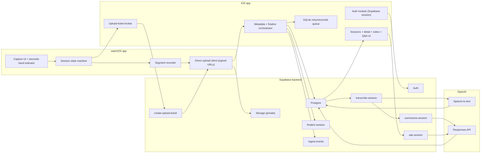

# 01) Product and Architecture

Split from: `IMPLEMENTATION_BLUEPRINT.md`  
Last updated: `2026-02-26`

## 1) End goal (defined before coding)

### 1.1 Product vision

Build a fast, privacy-conscious conversation capture system where:

- Apple Watch is the lowest-friction capture surface.
- iPhone is the auth anchor and control surface.
- Supabase is the single backend platform for auth, database, storage, and server runtime.
- OpenAI is used for transcription, summarization, and session Q&A.

### 1.2 Locked v1 decisions (applied from answered questions)

- Language scope: English only.
- Recording consent UX: no extra onboarding consent UI; active recording indicator is the compliance surface.
- Recording indicator: seconds hand presence indicates active recording.
- Watch behavior: capture-only UI (no local history screen).
- Upload path: watch uploads audio directly to Supabase Storage using short-lived upload tickets issued under iPhone-authenticated user context.
- Summary flow: run automatically after transcription.
- Summary failure semantics: set session to `failed`.
- Q&A context: transcript + latest summary + user notes.
- Retention: raw audio short retention (`30 days` default), transcript/summary/Q&A/notes retained indefinitely by default.
- Deletion model: hard delete only in v1 (no soft-delete columns, no partial artifact deletion modes).
- Export model: no backend export job in v1; support copy/share from iPhone UI.
- Multi-device: support multiple iPhones per user.
- Rate and quota baseline: per-user daily transcription quota of `3600` audio seconds (easy to change in DB), plus monitor-mode rate limits in all environments initially.

### 1.3 V1 scope (must be complete)

1. Capture:
- User starts/stops multiple audio segments from watch in one conversation session.
- User finalizes session from watch.

2. Sync and processing:
- Watch uploads segments directly to Supabase Storage with signed upload tickets.
- iPhone upserts metadata and orchestrates finalize/retries.
- Backend transcribes and summarizes each finalized session automatically.

3. Retrieval:
- iPhone shows session list and details (transcript, summary, notes, Q&A).
- User can ask follow-up questions scoped to one session.
- User can copy/share transcript/summary/answer content from iPhone.

4. Observability:
- Every significant transition is tracked.
- Every pipeline stage is auditable, retryable, and correlated.

### 1.4 Non-goals (v1)

- No fully hidden recording mode.
- No non-English transcription/summarization.
- No watch local history UI.
- No multi-tenant team/shared workspace model.
- No custom model training.

### 1.5 Definition of done (release gate)

V1 is done only when all are true:

- Functional:
  - End-to-end path works from watch recording to iPhone Q&A.
  - Retries are safe (no duplicate side effects).
- Security and privacy:
  - RLS enforced on all user-owned tables.
  - Storage bucket(s) private by default.
  - Active recording indicator is always visible when capture is active.
- Reliability:
  - Upload/transcription/summarization failures are recoverable.
  - Summary failure transitions session to `failed`.
- Governance:
  - Per-user daily audio quota (`3600s`) is enforced with configurable DB settings.
  - Rate-limit evaluation runs in monitor mode in all environments at launch.
- Observability:
  - Mandatory event catalog implemented and validated.
  - Pipeline metrics, error codes, and cost metrics queryable in dashboards.

## 2) Research-backed implementation constraints

Validated against primary docs as of `2026-02-26`.

1. App Store policy constraint:
- App Review Guideline `2.5.14` requires explicit consent and clear visual and/or audible indication for recording user activity.
- Product implication: recording state cannot be hidden; seconds-hand indicator remains mandatory.

2. Watch connectivity behavior:
- `transferUserInfo` and `transferFile` are queued background-capable transfers.
- `sendMessage` is immediate and requires reachability.
- Product implication: use queued transfer for metadata/ticket sync, immediate messages for fast status only.

3. Supabase Edge runtime limits:
- Hosted limits include memory, wall-clock timeout, CPU time, and request idle timeout.
- Product implication: split long work into bounded stages and persist stage state between calls.

4. Supabase storage security model:
- Uploads are denied by default without storage RLS policies.
- Upsert requires additional permissions (`SELECT` + `UPDATE`) and can increase overwrite risk.
- Product implication: immutable object writes with deterministic paths and short-lived signed upload URLs.

5. Supabase auth model:
- iPhone remains the primary authenticated client.
- Product implication: watch does not hold long-lived Supabase user sessions; watch receives short-lived upload tickets minted through iPhone-authenticated flows.

## 3) Product experience specification

### 3.1 Apple Watch

- Home state:
  - Minimal watch-face-style UI.
  - Ready-to-record affordance.
- Interactions:
  - Single tap toggles segment recording start/stop.
  - Long press finalizes current session.
- Compliance UX:
  - recording on: seconds hand visible
  - recording off: seconds hand hidden
- Failure UX:
  - explicit sync/upload pending and error states
- Scope limit:
  - no session history browsing on watch in v1

### 3.2 iPhone

- Authenticated shell (Supabase Auth session required).
- Session list:
  - reverse chronological
  - status chips (`sync_pending`, `uploaded`, `transcribing`, `summarizing`, `summarized`, `failed`)
  - duration + timestamps
- Session detail:
  - transcript (English)
  - summary variants
  - user notes field included in Q&A context
  - Q&A panel scoped to this session
  - copy/share actions for transcript, summary, and Q&A output
- Reliability UX:
  - retry controls for failed pipeline stages
  - metadata reconciliation for direct-watch uploads

## 4) Architecture principles (modular and reusable)

1. Supabase-first backend:
- Auth: Supabase Auth
- Database: Supabase Postgres
- File storage: Supabase Storage
- Compute: Supabase Edge Functions
- Scheduling/maintenance: Supabase `pg_cron` for bounded workers and cleanup

2. Contract-first development:
- define payload + error contracts before implementation
- no endpoint without schema and idempotency semantics

3. Event-first instrumentation:
- every significant state transition emits one structured event
- no silent transitions

4. Idempotency everywhere:
- all write endpoints accept/require idempotency context
- retries are always safe

5. Versioned evolution:
- version event schemas, prompt templates, and response contracts
- additive changes by default

6. Bounded modules with explicit interfaces:
- each module exposes inputs/outputs
- framework specifics stay inside module boundaries

## 5) Target system architecture

## 6) Module boundaries and reusable components

### 6.1 Watch module set

- `CaptureUI`:
  - renders state and indicator
  - emits user actions only
- `RecordingEngine`:
  - owns `AVAudioSession` and local segment files
- `WatchSessionOrchestrator`:
  - session transitions and finalize intent
- `WatchUploadClient`:
  - uploads segment files to signed URLs
  - handles retry and ticket expiry refresh
- `ConnectivityAdapter`:
  - wraps `WCSession` for ticket/metadata/status exchange

### 6.2 iPhone module set

- `AuthModule`:
  - Supabase session lifecycle
- `UploadTicketBroker`:
  - requests short-lived storage tickets for watch uploads
- `MetadataOrchestrator`:
  - upserts segment/session rows
  - calls finalize endpoint
- `SyncQueue`:
  - SQLite-backed durable retries and reconciliation
- `ConversationReadModule`:
  - list/detail hydration
- `QAModule`:
  - submit question with notes context
  - receive/store answer

### 6.3 Backend module set (Edge + SQL)

- `UploadTicketIssuer` (`create-upload-ticket`)
- `SessionLifecycle` (`finalize-session`)
- `TranscriptionStage` (`transcribe-session`)
- `SummaryStage` (`summarize-session`)
- `ConversationQA` (`ask-session`)
- `ObservabilityIngest` (`ingest-events`)
- `QuotaAndRateLimiter` (shared DB/edge module)

## 7) Canonical workflows

### 7.1 Capture-to-summary workflow

1. Watch records one or more segments.
2. Watch obtains signed upload ticket(s) via iPhone broker.
3. Watch uploads audio directly to Supabase Storage.
4. iPhone upserts segment/session metadata and validates segment completeness.
5. iPhone calls `finalize-session`.
6. Backend enqueues/executes transcription stage.
7. On transcription success, backend runs summarization automatically.
8. On summarize failure, session becomes `failed`.
9. iPhone reads updated state and renders transcript/summary.

### 7.2 Q&A workflow

1. User opens a transcribed/summarized session.
2. User optionally adds notes in session detail.
3. iPhone calls `ask-session` with `session_id`, `question`, and note context.
4. Backend validates ownership and quotas/rate limits, then calls model.
5. Backend stores answer and usage metrics.
6. iPhone renders answer and history.

### 7.3 Error/retry workflow

- Ticket expiry/network errors trigger ticket refresh and retry.
- Failed stage writes structured failure rows and remains retryable.
- Idempotency keys prevent duplicate side effects.

## 8) “Track everything” observability contract

Mandatory tracked surfaces:

- user actions (capture, finalize, note update, question asked)
- upload lifecycle (ticket issued, upload attempted/succeeded/failed)
- backend stage transitions (queued/running/succeeded/failed)
- model call usage (model, tokens, latency, estimated cost)
- security context (user, device, request_id, correlation_id)

All tracked records must include:

- `request_id`
- `correlation_id`
- `user_id` where known
- `device_id` and platform
- `event_version`
- server receive timestamp

## 9) Operational defaults selected for v1

- Transcription model policy:
  - choose cheapest approved model at runtime
  - fallback to next cheapest approved model if unavailable/quality gate fails
- Transcript length policy:
  - no product-level max transcript length
  - internal chunking is allowed only when model context limits require it
- Temperature defaults:
  - transcription: provider default
  - summary: `0.2`
  - Q&A: `0.0`
- Status updates:
  - hybrid realtime + polling fallback
- Alert thresholds:
  - transcription failure rate `>5%` for 15 minutes
  - summarize failure rate `>5%` for 15 minutes
  - ask-session failure rate `>3%` for 15 minutes
  - quota/rate-limit decision errors `>1%` for 15 minutes
- Rate-limit dashboard review:
  - reviewed daily by engineering owner/on-call
  - reviewed weekly with product owner before any enforcement-mode rollout
- Latency SLO targets (p95):
  - `finalize-session`: `<= 1.5s`
  - `transcribe-stage`: `<= 45s` for 10-minute input
  - `summarize-stage`: `<= 8s`
  - `ask-session`: `<= 10s`
- Cost controls:
  - weekly spend cap enabled in v1 with automated alerting (seed default: `$250/week` global)
- Logging privacy:
  - redact raw transcript text, question text, note text, email/IP, and auth token material from logs

## 10) Pre-development artifacts required (must exist first)

1. Product spec freeze:
- v1 scope/non-goals
- acceptance criteria

2. Contract pack:
- endpoint schemas and error code registry
- idempotency contract for each write endpoint
- signed upload-ticket contract

3. Data pack:
- SQL schema + RLS matrix
- storage path + ticketing policies
- retention and cleanup jobs

4. Observability pack:
- event catalog v1
- log redaction rules
- dashboard + alert definitions

5. AI pack:
- prompt template registry
- model price/quality policy
- cost and quota guardrails

## 11) Risks and mitigations

1. Recording policy rejection risk:
- mitigation: always-visible seconds-hand recording indicator and review checklist.

2. watchOS interruption/network variance:
- mitigation: segment-based capture plus signed-ticket refresh and retry queue.

3. Direct-watch upload reconciliation risk:
- mitigation: phone reconciliation job compares storage objects against metadata rows.

4. Edge runtime limit risk:
- mitigation: DB-backed staged worker with bounded execution windows.

5. Cost blow-up risk:
- mitigation: per-user daily audio quota, weekly budget cap, and monitor-mode rate controls.

## 12) References (primary sources used)

- Apple App Review Guidelines (`2.5.14`): <https://developer.apple.com/app-store/review/guidelines/>
- Apple Watch Connectivity transfer semantics: <https://developer.apple.com/library/archive/documentation/General/Conceptual/AppleWatch2TransitionGuide/UpdatetheAppCode.html>
- Supabase Edge Functions overview: <https://supabase.com/docs/guides/functions>
- Supabase Edge runtime limits: <https://supabase.com/docs/guides/functions/limits>
- Supabase Function `verify_jwt`: <https://supabase.com/docs/guides/functions/function-configuration>
- Supabase Storage access control: <https://supabase.com/docs/guides/storage/security/access-control>
- Supabase Storage uploads guidance: <https://supabase.com/docs/guides/storage/uploads/standard-uploads>
- Supabase Auth Apple login: <https://supabase.com/docs/guides/auth/social-login/auth-apple>
- OpenAI speech-to-text: <https://platform.openai.com/docs/guides/speech-to-text>
- OpenAI Responses API: <https://platform.openai.com/docs/api-reference/responses>
